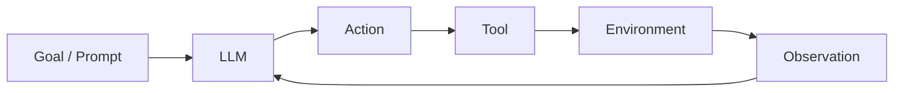

### North Star
> **Software Building Lifecycle → we want this faster.**

#### Current Software Building Lifecycle
1. Idea
2. Design
3. Implementation
4. Testing
5. Deployment
6. Monitoring
7. Iteration

### How It Works
1. **LLM**: It reads your prompt and predicts the most likely next words, one token at a time.

2. **Agent**: An agent is an LLM that can decide what action to take, use tools, observe the result, and continue until the task is done.

An agent is not just "answering"; it is thinking, taking actions, seeing results, and adjusting its next step.

3. **Coding Agent**: A coding agent is an agent specialized for software work. Claude Code mostly uses tools like `bash` to read files, search the codebase, edit code, and run commands.
   - Real examples:
     - **Bug fix**: User says "the login button does nothing." Agent greps for the button's click handler, reads the file, spots a missing `await` on an async call, edits the line, then runs the test suite to confirm the fix.
     - **Add a feature**: User says "add a `/health` endpoint." Agent reads the router file to understand the existing route pattern, adds the new route in the same style, then runs the server and curls the endpoint to verify it returns `200 OK`.
     - **Refactor**: User says "extract the DB logic from `userController.js` into a service." Agent reads the controller, identifies all DB calls, creates `userService.js` with those functions, updates the imports in the controller, and runs tests to ensure nothing broke.
